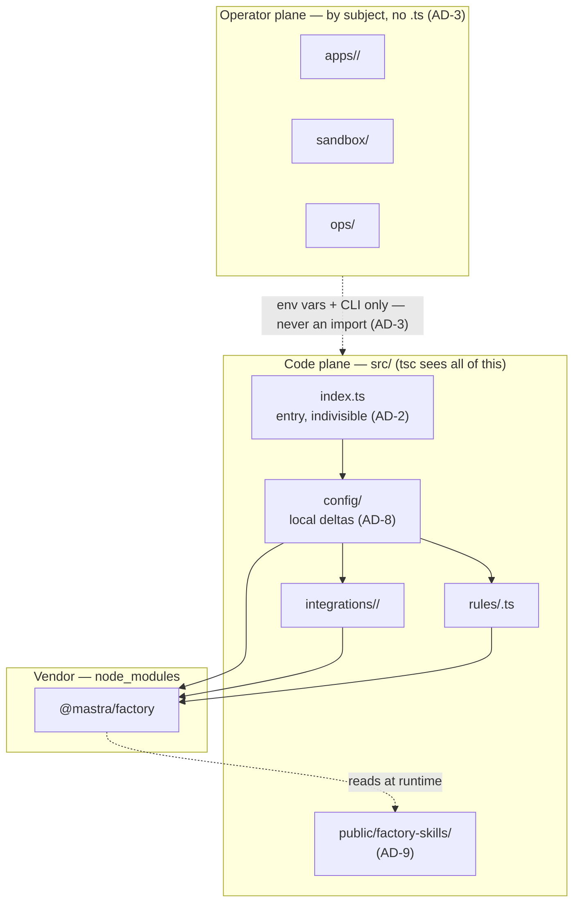
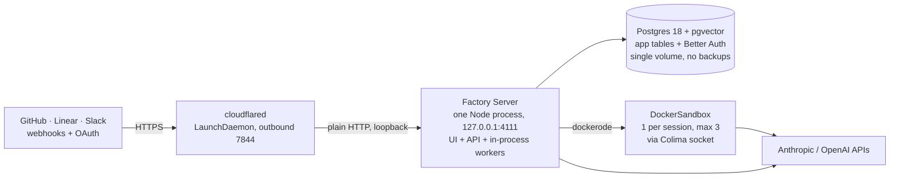

# Architecture Spine — mastra-factory repo structure

## Design Paradigm

**Two-plane monolith over one subject vocabulary.**

One deployable, one npm package, one process. Everything in the repo belongs to exactly one of two planes:

- **Operator plane** — artifacts a *human or an external system* consumes: a provider console, `docker build`,
  `launchd`, `newsyslog`. Organized **by subject** (`apps/github/`, `apps/slack/`, `sandbox/`, `ops/`).
  Contains no first-party TypeScript, ever.
- **Code plane** — everything under `src/`, where the TypeScript compiler's reach defines the boundary.
  Organized by the **same subjects**, so one vocabulary spans both planes.

The planes never mix. The operator plane reaches the code plane only through environment variables and CLI
invocation — never an import.

## Invariants & Rules

### AD-1 — One npm package, no workspaces `[ADOPTED]`

- **Binds:** all
- **Prevents:** a workspace split that creates empty packages and re-resolves every dependency on a machine
  with no backups.
- **Rule:** the repo has exactly one `package.json` and one `package-lock.json`, both at root. Package manager
  is **npm**. No `workspaces` field, no pnpm/yarn workspace file. The stray `pnpm-workspace.yaml` is template
  residue and non-normative.

### AD-2 — The entry file is indivisible `[ADOPTED — external constraint]`

- **Binds:** `src/mastra/index.ts`
- **Prevents:** a refactor that breaks `mastra build` in a way nothing catches until deploy.
- **Rule:** `src/mastra/index.ts` must export a `Mastra` instance named `mastra`, constructed by a **literal**
  `new Mastra(...)` **in that file**. The deployer's `checkConfigExport` Babel plugin inspects the entry's
  source. Never re-export the instance from another module; never build it in a helper.

### AD-3 — Two planes, one subject vocabulary

- **Binds:** all
- **Prevents:** the same subject acquiring two names (`slack/` vs `integrations/slack-app/`), and operator
  artifacts scattering into code directories.
- **Rule:** every new file belongs to exactly one plane (except the trees named in AD-13). Operator-plane
  directories are named for their subject and hold no first-party code. Code-plane directories under `src/`
  reuse the **identical** subject name; a subject present in both planes uses one spelling in both.
- **Namespace:** a subject is either a **provider/app** — something with an external console and credentials
  (`github`, `linear`, `slack`) — which lives under `apps/`; or **host infrastructure** (`sandbox`, `ops`),
  which lives at root. Root is a **closed set**, enumerated in the two lists below: adding a new root
  directory is a spine change, not a local call.
- **Root directories — closed set, eleven** — `apps/`, `docs/`, `ops/`, `sandbox/`, `src/`, plus the six trees
  AD-13 places outside both planes: `.agents/`, `_bmad/`, `_bmad-output/`, `.bmad-loop/`, `.claude/`,
  `node_modules/` (the last is gitignored and never tracked). Those eleven names are the whole set; nothing
  else may exist as a root directory — not a top-level test directory, not a scripts or config directory. A
  test lives beside the code it covers under `src/`; a script that wants a language runtime lives under `src/`
  behind an npm script (AD-4).
- **Root allowlist — closed set, twelve files** — every file that may sit at root, each because a tool or a
  platform convention fixes it there, so it belongs to no subject directory:

  | File | What fixes its location |
  | --- | --- |
  | `package.json` | npm, at the package root (AD-1) |
  | `package-lock.json` | npm, beside `package.json` (AD-1) |
  | `tsconfig.json` | `tsc` and `mastra build`, resolved from the project root |
  | `docker-compose.yml` | `docker compose`, read from cwd by `npm run db:up` |
  | `.env` | varlock, resolved from the repo root (AD-11); gitignored, never tracked |
  | `.env.schema` | varlock, resolved from the repo root (AD-11) |
  | `.env.example` | convention, beside `.env.schema` — the file an operator copies |
  | `.gitignore` | git, at the repo root |
  | `AGENTS.md` | coding agents read it from the repo root; no path argument exists |
  | `README.md` | forges and humans render the repo-root README; no path argument exists |
  | `skills-lock.json` | the Mastra CLI writes it at the project root (vendored — AD-13, never hand-edited) |
  | `.mastra-project.json` | the Mastra CLI writes it at the project root |

  Moving any entry whose consumer *does* take a path requires updating that consuming tool in the same
  change. The last four are worth spelling out because they look movable and are not: `AGENTS.md`,
  `README.md`, `skills-lock.json` and `.mastra-project.json` are each located by a tool or a platform that
  **accepts no path argument**, so moving them would mean editing a consumer this repo does not own. Nothing
  else may be tracked at root. Adding an entry to either closed set is a spine change, recorded here — and for
  a file whose location really is movable, the fix is to move it under its owning subject instead. The
  bmad-loop verify gate **derives both sets from this section** — the table's rows and the closed-set bullet
  above — and checks them against `git ls-files` *and* `git ls-files -o --exclude-standard`, because the
  orchestrator stages the working tree when it commits a story, so an untracked-but-not-ignored root entry
  would otherwise be verified green and then committed. A stray root file, a missing one, or a new root
  directory fails the gate naming itself, and widening root is only possible by editing the two lists here.
  Two editing constraints follow from the gate reading this section as machine input: keep the root-directory
  bullet immediately above the root-allowlist bullet, and keep this section ending at the `### AD-4` heading —
  the gate slices between those markers and fails, rather than guessing, if either range runs past its end.

### AD-4 — All first-party program code lives under `src/`

- **Binds:** all first-party code
- **Prevents:** code that `npm run check` cannot see — the only real check in the bmad-loop verify gate.
- **Rule:** no first-party `.ts`, `.js`, `.mjs`, `.cjs` or other program source outside `src/`.
  `tsconfig.json` keeps `include: ["src/**/*"]`. Widening `include` is a spine change, not a local fix.
- **Carve-out:** operator shell scripts (`ops/*.sh`) are exempt — `launchd` and the wrapper invoke them by
  path and they cannot live under `src/`. They stay thin: process supervision and file placement only, never
  application logic. Logic that wants a language runtime belongs in `src/` behind an npm script.

### AD-5 — Files are canonical; prose links out

- **Binds:** operator plane, `docs/`
- **Prevents:** two copies of a plist, Dockerfile or conf drifting apart silently.
- **Rule:** every operational artifact exists as exactly one real file at its own path. `docs/` keeps
  narrative, decisions and risk analysis, and references artifacts **by path** — it does not reproduce their
  contents in fenced blocks. A code block in `docs/` is illustrative only and must be marked non-normative.

### AD-6 — Environment-key truth is split by nature

- **Binds:** `.env.schema`, every operator-plane subject README, `README.md`
- **Prevents:** two competing definitions of the same key, with no rule for which wins.
- **Rule:** `.env.schema` is normative for **validation, generated types, and `@public`/sensitive marking** —
  it is the only list of keys. **The owning subject's own README** is normative for **what the value must
  contain and how to obtain it**. Every key has exactly one owning subject, and the authority on which
  subject that is, key by key, is the six owned-keys tables described below — not an enumeration here,
  which would go stale the moment a key is added. Neither side restates the other's half.
- **Residual owner:** the operator-plane subject set is closed by AD-3, so a key with no subject directory
  of its own — database, credential encryption, platform, WorkOS, Postgres, model providers — is owned by
  **`README.md`**. Inventing an `auth/` or `db/` directory to house one would be an AD-3 change, not a
  local call. *(Added 2026-09-23 by Story 5.2; the audit found the rule written short.)*
- **Ownership is written, and total:** each of the six owners carries a `## Keys this subject owns` section
  (`## Keys this file owns` in `README.md`) whose table's first cell is one backticked key name. The six
  key sets are pairwise disjoint and their union is exactly the `.env.schema` key set — a written partition
  rather than prose, and checked by `[verify].commands` rather than asserted here. Disjoint and total does
  not by itself say *which* owner, so for the four families whose owner is mechanical the gate pins it:
  `GITHUB_APP_*`, `LINEAR_*`, `SLACK_APP_*` and `FACTORY_SANDBOX_*` are claimed by their own subject and
  by no other table. That is a prefix rule, not the per-key enumeration declined above — it goes stale
  only when a *family* is added, not when a key is. *(Added 2026-09-23 by Story 5.2's review pass, after
  a `SLACK_APP_*` row was moved into `README.md` with the partition still total and the gate green.)*
- **Where the restatement line falls:** a README **may** describe what goes wrong and what the operator
  sees. It **may not** name the schema's own mechanism — `@required`, `@public`, `@sensitive`, or a
  declared type or pattern. Symmetrically, `.env.schema` gives no provider-console navigation and no
  credential-generation command; it points at the owning README for both. Non-obvious runtime behaviour
  behind a key lives in `docs/self-hosting-research.md` §11, which every owned-keys section references by
  path and none copies.

### AD-7 — One read site per environment key `[ADOPTED]`

- **Binds:** code plane
- **Prevents:** a key read in several places acquiring different defaults or trim/parse behavior, and the
  `docs/self-hosting-research.md` §11 trap table becoming unfindable.
- **Rule:** `process.env.X` for any given `X` appears at **exactly one** location in first-party code. Its
  location is unrestricted within `src/mastra/`. Every consumer receives the parsed value by argument or
  module export. *(Facilitator addition; adopted by Yurii on 2026-09-22.)*

### AD-8 — The entry is fully extracted, and its template provenance is recorded

- **Binds:** `src/mastra/index.ts`, `src/mastra/config/`
- **Prevents:** a hybrid entry where some construction is extracted and some is not, with no rule for which;
  and a future Mastra template update becoming unmergeable archaeology.
- **Rule:** extraction is **total, not partial**. All environment reading and all instance construction
  — upstream's (storage, vector, pubsub, auth, integrations, sandbox) *and* the local additions
  (`DockerSandbox` branch, Better Auth provider) — move into `src/mastra/config/`, one module per concern.
  `index.ts` retains **only** imports, the `factory.prepare()` call, the literal `new Mastra(...)` (AD-2), and
  `factory.finalize()`. No partial state: a module is either fully extracted or not yet started.
- **Provenance:** because this makes the entry structurally unlike upstream, `src/mastra/config/README.md`
  **must** record the `@mastra/factory` version and template origin the entry was forked from, and be updated
  on every reconciliation — so a template update is a three-way diff rather than archaeology. This is the
  accepted cost of full extraction; the record is what keeps it payable.

### AD-9 — Factory-skill overrides use the package-dictated path `[ADOPTED — external constraint]`

- **Binds:** customized factory skills
- **Prevents:** a customized skill placed in an intuitive-but-wrong directory that silently never loads.
- **Rule:** repo-local overrides of the six bundled factory skills go at
  `src/mastra/public/factory-skills/<skill-name>/SKILL.md` — the one candidate path valid under both cwd
  variants the server runs with. Only these six names resolve: `configure-factory-rules`,
  `factory-complete-issue`, `factory-plan`, `factory-rereview`, `factory-review`, `factory-triage`.
  Override is per-file: a local file wins, absent ones fall back to bundled. This path is **not** the
  `.agents/skills/` tree, which is a separate, hash-locked vendored concern (`skills-lock.json`) and must not
  be hand-edited.

### AD-10 — Extension seams mirror subjects inside the code plane

- **Binds:** future integration code
- **Prevents:** a new integration landing in the operator plane, or three sessions choosing three layouts for
  the same kind of extension.
- **Rule:** a new `FactoryIntegration` implementation goes in `src/mastra/integrations/<subject>/`. Event-rule
  overrides for an existing integration go in `src/mastra/rules/<subject>.ts`. Subclassing an integration is a
  code-plane concern and follows the same path. None of these are ever a reason to create a package (AD-1).

### AD-11 — The repo root path and npm script names are an external contract

- **Binds:** `package.json` scripts, repo location
- **Prevents:** a rename that silently breaks 24/7 supervision, discoverable only after a reboot.
- **Rule:** `npm run start` must remain the production entry point and must work with the repo root as cwd —
  `ops/factory-start.sh` execs it after `cd`, and the LaunchAgent pins `WorkingDirectory` to the repo root.
  varlock resolves `.env`/`.env.schema` from root. Renaming the `start` script, or moving the repo, requires
  updating `ops/launchagents/ai.mastra.factory.plist`, `ops/factory-start.sh` and
  `ops/newsyslog/ai.mastra.factory.conf` in the same change.

### AD-12 — Single machine, single process, no Redis `[ADOPTED]`

- **Binds:** runtime topology
- **Prevents:** code written for horizontal scale that the deployment will never provide, and re-litigating a
  settled operational decision.
- **Rule:** one Node process serves UI and API; workers are in-process async loops. `REDIS_URL` stays unset
  and the `redis` service is absent from `docker-compose.yml`. Sandboxes are Docker containers on the same
  host via Colima, capped by `MASTRACODE_MAX_SANDBOXES`. Any design assuming multiple replicas, shared
  external queues, or cross-process leases contradicts this AD and is a conflict to surface, not a local
  choice. Full rationale and risk register: `docs/self-hosting-research.md` §0, §1, §7.

### AD-13 — Vendored and tooling trees are outside both planes

- **Binds:** `.agents/`, `_bmad/`, `_bmad-output/`, `.bmad-loop/`, `.claude/`, `node_modules/`
- **Prevents:** AD-3 being read as a mandate to reorganize vendored or tool-owned trees by subject, and
  hand-edits to hash-locked vendored content.
- **Rule:** these trees belong to neither plane and are exempt from subject grouping. `.agents/skills/` is
  **vendored** — its content is hash-tracked in `skills-lock.json` and must be updated through its own tooling,
  never hand-edited (a hand edit either breaks the hash or is silently overwritten). The tree and
  `skills-lock.json` are pinned **together** by a digest in the bmad-loop verify gate, so a legitimate
  CLI-driven update moves the two files and that digest in the same change — and any other edit to either,
  staged or committed, fails the gate. `_bmad/` and `.claude/`
  are tool-owned. `_bmad-output/` is generated. None of them is a home for first-party code (AD-4).

### Dependency direction



## Consistency Conventions

| Concern | Convention |
| --- | --- |
| Subject names | Lowercase, singular, identical in both planes: `github`, `linear`, `slack`, `sandbox`. Never `github-app`, never `slack_integration`. |
| Operator-plane files | One subject per directory; a `README.md` in each stating what the operator must do and which env keys it feeds (AD-6). |
| Sandbox image tags | Date-tagged (`factory-sandbox:YYYY-MM-DD`), never `latest`, so a bad image is an env-var rollback via `FACTORY_SANDBOX_IMAGE`. |
| Env keys | Groups share a prefix (`GITHUB_APP_*`, `FACTORY_SANDBOX_*`). All-or-nothing groups are validated at construction and report "not configured" rather than throwing. |
| Config errors | An unconfigured integration degrades silently and reports its state to diagnostics; it never blocks boot. Partial configuration stays disabled and remains visible to the status route. |
| Secrets | Never in the repo. `.env` is gitignored; `.env.schema` and `.env.example` carry key names and shapes only. |
| Docs | Reference artifacts by repo-relative path. Section numbers in `docs/self-hosting-research.md` are stable citation anchors — don't renumber. |

## Stack

Seed. The code owns this from here.

**Installed** — read from `package.json` and the tree on 2026-09-22:

| Name | Version |
| --- | --- |
| Node | `>=22.19.0` (running v24.19.0) |
| TypeScript | ^5.9.2 |
| `@mastra/core` | 1.67.0 |
| `@mastra/factory` | 0.15.0 |
| `mastra` (CLI) | 1.30.0 |
| `@mastra/pg` | 1.25.0 |
| varlock | ^1.9.0 |
| Postgres | 18 + pgvector (`pgvector/pgvector:pg18`) |
| npm | package manager, root lockfile (AD-1) |

**Planned, not yet resolved** — versions carried from `docs/self-hosting-research.md`, which verified them
against packages inspected elsewhere. Neither is in `package.json` or `node_modules` as of 2026-09-22.
**Re-verify at install; treat these numbers as intent, not as pins:**

| Name | Intended version | Needed for |
| --- | --- | --- |
| `@mastra/docker` | 0.8.0 | Docker sandboxes (§2) — core peer `>=1.67.0` |
| `@mastra/auth-better-auth` | 1.1.5 | Better Auth provider (§3) — peer `hono@^4` |

## Structural Seed

```text
mastra-factory/
  src/mastra/
    index.ts                      # entry — literal new Mastra(...) lives here (AD-2)
    config/                       # local deltas + template provenance (AD-8)
      README.md                   #   forked-from version record — REQUIRED
    integrations/<subject>/         # future FactoryIntegration implementations (AD-10)
    rules/<subject>.ts              # future event-rule overrides (AD-10)
    public/factory-skills/        # skill overrides — path dictated by package (AD-9)
  apps/
    github/README.md              # permissions, webhook events, URLs
    linear/README.md              # OAuth scopes, redirect URL
    slack/
      README.md                   # settings, bot events
      manifest.yaml               # authored — the package ships no manifest
  sandbox/
    factory-sandbox.Dockerfile    # generic toolchain image; copies no app code
    README.md                     # build + retag command, tag history
  ops/
    README.md                     # owns DOCKER_HOST + supervision vars (AD-6)
    launchagents/*.plist          # colima + factory (AD-11)
    factory-start.sh              # wait-for-socket wrapper (AD-4 carve-out)
    newsyslog/*.conf              # log rotation
    install.sh                    # symlink, mkdir logs, bootstrap
  docs/
    self-hosting-research.md      # narrative + risk register; links out (AD-5)
  docker-compose.yml              # root — tool-mandated
  .env.schema / .env.example      # root — varlock resolves from here (AD-11)
  package.json / package-lock.json
  AGENTS.md                       # root — coding agents read it from here, no path argument
  README.md                       # root — the repo-root README forges render
  skills-lock.json                # root — written by the Mastra CLI; vendored (AD-13)
  .mastra-project.json            # root — written by the Mastra CLI
```

Root is exactly the two closed sets AD-3 enumerates — those twelve files (`.env` and `.gitignore` included;
`.env` is gitignored) and eleven directories — and nothing else. The bmad-loop verify gate derives both sets
from AD-3 and checks them against `git ls-files`.

The gate separately checks the **twelve operator-plane artifacts** in the tree above — everything under
`apps/`, `sandbox/` and `ops/`, namely the three `apps/*/README.md` plus `apps/slack/manifest.yaml`, the two
files in `sandbox/`, and `ops/README.md`, both `launchagents/*.plist`, `factory-start.sh`, `newsyslog/*.conf`
and `install.sh` — requiring each to be tracked in the index as a real, non-empty regular file at exactly the
path named here (AD-5). The `src/` entries, `docs/self-hosting-research.md` and the root files above are
outside that list: the code plane is covered by `tsc` and the root files by the closed-set check.

### Deployment & operational envelope `[ADOPTED — AD-12]`



Single machine, started by LaunchAgents at user login (not daemons — Colima needs a session). FileVault is on,
so unattended recovery from an unplanned reboot is impossible by design; accepted. No backups; the Postgres
volume is the only copy. Details and the full risk register: `docs/self-hosting-research.md` §1, §7, §9, §10.

## Deferred

| Deferred | Why it can wait | Revisit when |
| --- | --- | --- |
| Whether to restrict *where* env keys are read (not just how many times) | The code plane is a handful of modules; a location rule would be ceremony over nothing. AD-7 already preserves findability. | First-party code under `src/mastra/` grows past roughly a dozen modules, or a key's single read site stops being obvious. |
| Any workspace or multi-package layout | There is no first-party code to split; all three integrations ship compiled in `@mastra/factory`. | A new `FactoryIntegration` exceeds ~500 lines **and** must be shared across two deployments. Both conditions, not either. |
| Task orchestration (Turborepo / Nx) | Meaningless at one package. | Three or more packages exist with a real task graph. |
| CI beyond the local verify gate | Supervision is launchd on one machine; there is no remote runner. | The repo gains a second machine or a contributor. |
| Backup and restore strategy | Explicitly accepted as absent. | Any change that makes the Postgres volume harder to recreate than to restore. |
| Multi-tenant / per-org GitHub Apps | Single operator, single org. The subclassing seam exists if needed (AD-10). | A second organization needs its own App installation. |
| Test strategy for `src/mastra/config/` | Nothing extracted yet. | `config/` holds logic worth asserting on, rather than construction from env. |

## Open Questions

| Question | Blocking? | Owner |
| --- | --- | --- |
| ~~Does AD-7 ("one read site per key") survive review?~~ **Resolved 2026-09-22: adopted by Yurii.** The rule is normative; see AD-7. | No | Yurii |
