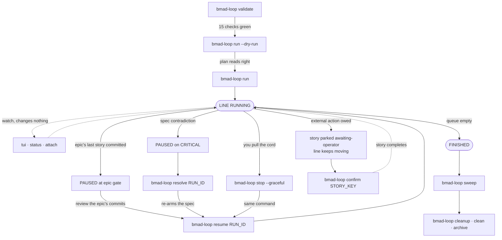
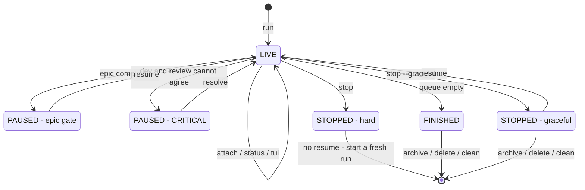
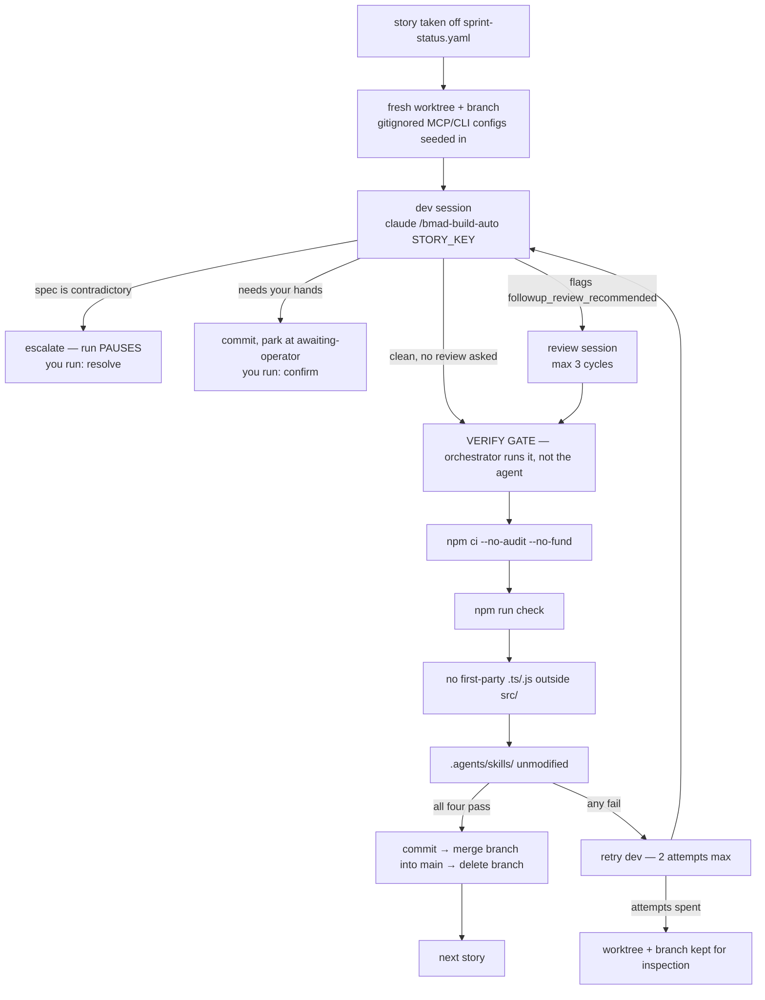
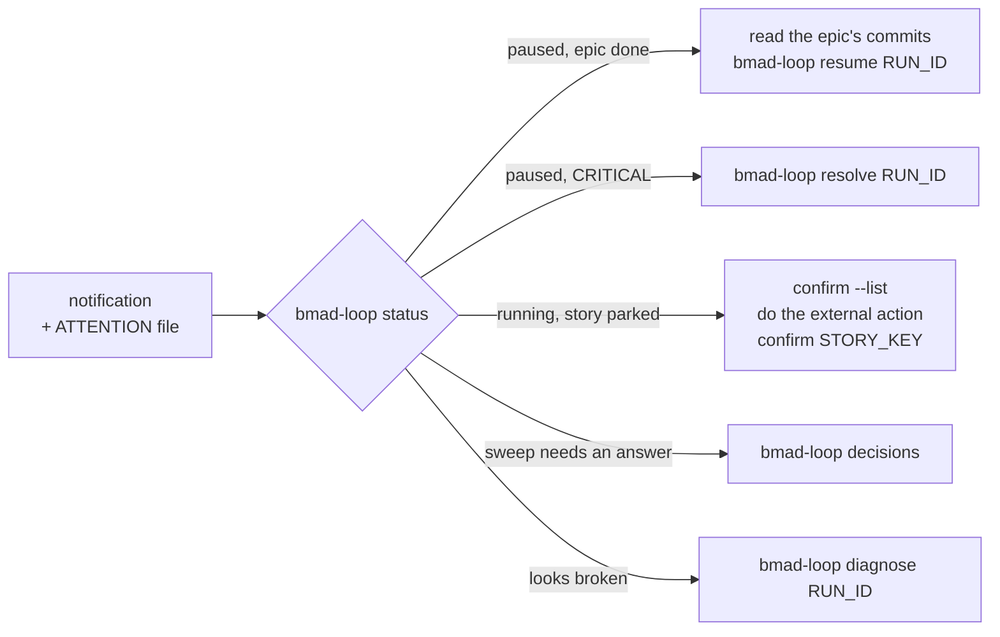

# bmad-loop — operator board

The line runs itself. Your job is the andon cord: know which lamp is lit, which command
answers it, and what is legal to call next.

Everything below is read off this project's own `.bmad-loop/policy.toml` and
`bmad-loop --help` (22 September 2026). Change the policy and the diagrams stop being
true — particularly `gates`, `scm.isolation`, `sweep.auto` and `operator.enabled`.

| | |
|---|---|
| **Gates** | `per-epic` |
| **Isolation** | `worktree`, one branch per story, merged into `main` |
| **Adapter** | `claude` for dev, review and triage |
| **Sweep** | `auto = never` |
| **Queue** | 24 stories |

---

## 1. The whole line, end to end

Three commands start work, four answer a stopped line, two clean up after it. Nothing
else is required to operate the loop.

Non-normative — the records are `bmad-loop --help` and `.bmad-loop/policy.toml`.


Solid arrows move the run between states; dotted arrows are observation or bookkeeping
that leaves the run where it was. Every pause resolves with exactly one command, and
three of the four end in `resume`.

---

## 2. What is legal after what

A run has five states. Most commands are only accepted in one of them — that is the
whole grammar.

Non-normative — the record is `bmad-loop --help`, which states where each command is accepted.


The two stop flavours differ only here: `stop --graceful` finishes the in-flight story
through its commit and stays resumable; a bare `stop` cuts immediately and you restart
with a fresh `run`, which re-reads the board and skips everything already done.

### Command index

Legality legend — **any time**: read-only, never wrong to run · **live**: needs a running
run · **waiting**: needs something waiting on you · **terminal**: needs the run to be over.

| Command | Legal when | What it leaves you in / what follows |
|---|---|---|
| `validate` | any time | Read-only preflight. Non-zero exit means `run` will not work yet. |
| `run --dry-run` | any time | Prints the dispatch plan, spawns nothing. Always the step before `run`. |
| `run` | no live run | → LIVE. Accepts `--epic`, `--story`, `--max-stories`, `--spec`. |
| `list` · `ls` | any time | Run ids and short refs — where you get the `RUN_ID` every other command wants. |
| `status [id]` | any time | Run + sprint state. `--json` for scripting. |
| `tui` | any time | Live dashboard. Cheaper than polling `status`. |
| `attach [id]` | live | tmux into the agent session. Detach with `Ctrl-b d` — do not kill the pane. |
| `stop --graceful` | live | → STOPPED (resumable). Also suppresses pending auto-sweeps. |
| `stop` | live | → STOPPED (hard). Next `run`/`sweep` reconciles leaked worktrees. |
| `stop --cancel-graceful` | graceful pending | Withdraws the request; the run keeps going. |
| `resume RUN_ID` | paused / stopped clean | → LIVE, from the same point. |
| `resolve RUN_ID` | CRITICAL only | Disambiguates the spec, re-arms, then prompts to resume. `--no-interactive` if you already fixed it by hand. |
| `confirm --list` | any time | Which stories are parked and what each one owes you. |
| `confirm STORY_KEY` | story parked | Completes it. Independent of whether a run is live. `--reverify` re-runs the verify gate first. |
| `decisions` | sweep left questions | Answers triage questions a sweep could not settle alone. |
| `sweep` | no live run | Works the deferred-work ledger. `auto = never` here, so it is always your call. |
| `diagnose [id]` | any time | Sanitized dump to hand to maintainers. Never mutates the run. |
| `cleanup` | terminal | Kills leftover tmux sessions and windows. |
| `clean` | terminal | Reclaims disk. Paused runs are never touched, so they stay resumable. |
| `archive RUN_ID` | terminal | Compresses into `.bmad-loop/archive`. `--force` stops a live run first. |
| `delete RUN_ID` | terminal | Removes the run directory. Progress survives — it lives in git and `sprint-status.yaml`. |

---

## 3. Inside one story

This is the cycle the loop repeats 24 times. You are not in it — unless it hits one of
the two human exits.

Non-normative — the records are `.bmad-loop/policy.toml` and `bmad-loop --help`.


The verify gate is deterministic and runs *after* review, *before* commit — which is why
`npm ci` comes first (a fresh worktree has no `node_modules`) and why the
`.agents/skills/` check catches uncommitted edits a self-committing session would have
hidden.

---

## 4. When a lamp lights

A desktop notification fires and an `ATTENTION` file lands in
`.bmad-loop/runs/<run-id>/`. One `status` call tells you which of five things happened.

Non-normative — the record is `bmad-loop --help`.


Only the first two hold the line. A parked story does not stop the run — the loop commits
what it built and moves on, and you clear the backlog of parked stories whenever it suits
you.

### Epic gate — the normal checkpoint

Fires after the last story of an epic commits, because `gates = "per-epic"`. Read the
diff, then release the line.

Non-normative — the record is `bmad-loop --help`.
```bash
git log --oneline main
bmad-loop resume RUN_ID
```

### CRITICAL escalation — the spec is wrong

Dev and review found a gap or a contradiction neither can safely settle — including
review writing a story back off `done` (`on_status_contradiction = "escalate"`).

Non-normative — the record is `bmad-loop --help`.
```bash
bmad-loop resolve RUN_ID
# or, spec already fixed by hand:
bmad-loop resolve RUN_ID --no-interactive
```

There is also a `/bmad-loop-resolve <story-key>` skill for the same job from inside a
Claude session.

### awaiting-operator — code is done, the world is not

The story shipped and committed, but its acceptance criteria need a human: start Docker,
publish DNS, grant an API key. Several stories in this backlog are shaped exactly that
way (`1-4-operator-…`, `2-1-operator-…`).

Non-normative — the record is `bmad-loop --help`.
```bash
bmad-loop confirm --list
bmad-loop confirm STORY_KEY --reverify
```

### Deferred work — the ledger, on your schedule

`sweep.auto = "never"`, so nothing is swept behind your back. Work it between runs.

Non-normative — the record is `bmad-loop --help`.
```bash
bmad-loop sweep --dry-run
bmad-loop sweep --min-severity high
bmad-loop decisions
```

---

## 5. Muscle memory

**Starting a shift**

Non-normative — the record is `bmad-loop --help`.
```bash
bmad-loop validate                  # is the bench clean?
bmad-loop run --epic 1 --dry-run    # is the plan right?
bmad-loop run --epic 1              # start the line
bmad-loop tui                       # second terminal, watch it
bmad-loop resume RUN_ID             # at the gate
```

**Ending a shift**

Non-normative — the record is `bmad-loop --help`.
```bash
bmad-loop stop RUN_ID --graceful    # finish the story first
bmad-loop status RUN_ID             # confirm it landed
bmad-loop resume RUN_ID             # tomorrow, same point
bmad-loop confirm --list            # clear anything parked
bmad-loop cleanup && bmad-loop clean  # once finished
```

---

## One thing the diagrams cannot show

`session_budget_mode = "warn"` means a runaway session gets a notification and a
breadcrumb but is **not** killed at the 4M weighted-token cap. Before leaving the line
unattended overnight, consider setting it to `"enforce"`.
