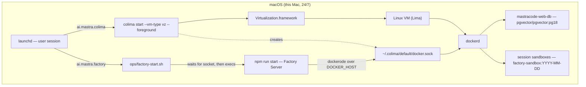
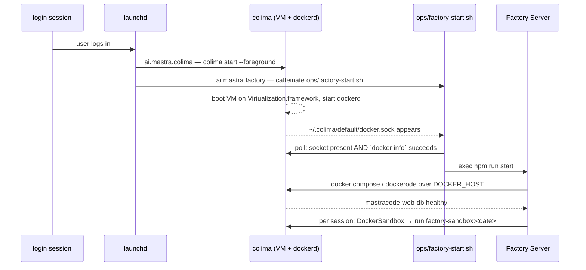

# The container runtime stack — Colima, Virtualization.framework, launchd

Why this deployment runs containers the way it does, and what each moving part is for.

Four names come up whenever this host's containers are discussed — **Apple's Virtualization.framework**,
**Colima**, **LaunchAgents**, and **Apple Containers** — and they are easy to mistake for four competing
choices. They are not. Three of them sit at different layers and all three are in use; the fourth is a
road not taken, and §3 is the record of why.

This file is background. It is **not** normative for anything:

- `ops/README.md` is the record for bring-up, `DOCKER_HOST`, the checkpoints, teardown and supervision.
- `docs/self-hosting-research.md` §0 is where the Colima decision was taken, and §7 is its supervision detail.
- `sandbox/README.md` is the record for building and tagging the session image.
- `.env.schema` is the only list of environment keys.

Nothing here restates a command those files own. Read this to understand the shape; read them to operate it.

---

## 1. The four things, one line each

| | What it is | Layer |
|---|---|---|
| **Virtualization.framework** | Apple's hypervisor API in macOS. Boots virtual machines. Knows nothing about images, registries or containers. | OS |
| **Colima** | A user-space tool that boots one Linux VM *on* that framework and runs the Docker engine inside it, publishing a Docker API socket on the Mac. | engine delivery |
| **launchd / LaunchAgents** | macOS's service supervisor. Starts Colima and the Factory Server at login and restarts them when they die. Orthogonal to containers entirely. | supervision |
| **Apple Containers** (`container`) | Apple's own container runtime, also on Virtualization.framework. A **peer of Colima**, not a layer above it. Not installed here. | *(not used)* |

The stack that is actually running:

Non-normative — the records are `ops/README.md` and `ops/launchagents/ai.mastra.colima.plist`.


Read the arrows as two separate concerns. Left-to-right is **supervision**: launchd owns two jobs and
neither knows about the other. Top-to-bottom is **virtualization**: every container on this host is a
Linux process inside one VM, and that VM is a guest of Apple's hypervisor.

---

## 2. Layer by layer

### 2.1 Virtualization.framework — the hypervisor, not a runtime

Apple's framework for running virtual machines on macOS, with hardware acceleration and paravirtualized
devices. It is an API, not a product: it boots a kernel, gives it virtual CPUs, memory, block devices and
network interfaces, and stops there. There are no images, no `docker pull`, no daemon.

Two things it supplies matter here, both visible in the Colima agent's flags:

- **`--vm-type vz`** selects this framework as the backend. The alternative Colima supports is QEMU, which
  emulates in user space and is markedly slower on Apple silicon.
- **`--mount-type virtiofs`** selects the paravirtualized filesystem for sharing host directories into the
  guest, which is what makes host paths readable from inside containers at usable speed.

Everything that runs Linux on this Mac — Colima today, Apple's `container` in the road-not-taken — sits on
this framework. Choosing between them is **not** a choice about the hypervisor.

### 2.2 Colima — what it actually is

Colima ("Containers on Lima") is a Go CLI, installed from Homebrew at `/opt/homebrew/bin/colima`
(`0.10.3`, with `lima 2.2.0` underneath). It wraps [Lima](https://lima-vm.io), a Linux-VM manager, and does
three things you would otherwise do by hand:

1. **Provisions and boots one Linux VM** with the CPU, memory and disk you ask for, on the backend you ask
   for. On first `colima start` this downloads an image and takes several minutes; afterwards it is a boot.
2. **Installs and runs a container runtime inside that VM** — `dockerd` here (Colima can also do containerd
   with nerdctl, which this deployment does not use).
3. **Forwards the runtime's socket out to the Mac** at `~/.colima/<profile>/docker.sock`, and registers and
   activates a **docker context** pointing at it — which is why a plain `docker ps` in an interactive shell
   works with no further setup.

The key consequence: from the Mac's point of view there is a **Docker Engine REST API on a Unix socket**.
Any Docker API client — the `docker` CLI, `docker compose`, or a library like dockerode — talks to it
without knowing a VM exists. That compatibility is the entire reason Colima is in this stack.

**Profiles.** A Colima instance is named; `default` is the one you get without `--profile`, and it is the
name in this deployment's socket path. Multiple profiles are independent VMs with independent sockets.

**What lives where:**

| Path | What it holds |
|---|---|
| `/opt/homebrew/bin/colima` | the CLI (Cellar: `/opt/homebrew/Cellar/colima/0.10.3/`) |
| `~/.colima/default/docker.sock` | the Docker API socket — the value `DOCKER_HOST` names |
| `~/.colima/default/` | the instance: its `colima.yaml`, `ssh_config`, `containerd.sock` |
| `~/.colima/_lima/` | the Lima VM itself — disk images, the guest's own state |
| `~/Library/Logs/mastra-factory/colima.log`, `colima.err.log` | this deployment's Colima agent output |

Note where container *data* is: not in the repo, and not in `~/.colima/default/`. Postgres lives in the
Docker named volume `mastra-factory_mastracode-web-pgdata` inside the VM, which `docker-compose.yml` pins
by project name precisely so a moved or re-checked-out repo still addresses the same volume.

### 2.3 LaunchAgents — supervision, and why agents rather than daemons

launchd is macOS's init and service supervisor. It reads property lists and keeps the jobs they describe
running. Two flavours matter: a **LaunchDaemon** runs system-wide from boot with no user session, and a
**LaunchAgent** runs inside a logged-in user's session.

This deployment uses agents, and `docs/self-hosting-research.md` §7 records why: **Colima runs inside a user
login session**, so a daemon would start before any session exists and Factory would crash-loop against a
Docker socket that is not there. Setting `UserName` does not fix it — that changes the uid, not the session.
The price is that logging out kills the deployment, which is why fast user switching is off.

Two agents, both symlinked into `~/Library/LaunchAgents/` by `ops/install.sh` so the repo copy stays the
only copy:

- **`ai.mastra.colima`** — runs `colima start … --foreground`. The `--foreground` flag is what earns its
  keep: without it `colima start` returns as soon as the VM is up and launchd would treat the job as
  finished. With it, launchd supervises the VM process itself.
- **`ai.mastra.factory`** — runs `ops/factory-start.sh` under `caffeinate`, which ends in `exec npm run start`.

**launchd has no dependency ordering.** It starts both agents independently and will not sequence them.
That single fact is the reason `ops/factory-start.sh` exists at all: the Factory side polls for the socket
*and* a succeeding `docker info` — a socket file alone is not a running engine — on a wall-clock bound, and
exits non-zero rather than hanging, because a job that exits is a job launchd retries.

### 2.4 Apple Containers — a peer, not a layer

Apple's `container` (built on Apple's open-source Containerization framework) is a container runtime that
runs **each container in its own lightweight VM** on Virtualization.framework. It is a genuine alternative to
Colima-plus-Docker, not something that stacks with it: both occupy the same slot in the diagram above.

It is **not installed on this host** — there is no `container` binary on the PATH, no application bundle, and
the only `com.apple.container*` launchd entries are stock macOS services unrelated to it.

The decisive difference for this deployment is the **control plane**. Apple's `container` is driven through
XPC services and its own CLI. It does not expose a Docker Engine REST API on a Unix socket. Everything in §3
follows from that one property.

---

## 3. Why Colima and not Apple Containers

`docs/self-hosting-research.md` §0 states the decision in one row:

> **Colima `--vm-type vz`** — Apple's Virtualization.framework + a Docker socket. Apple's own `container`
> speaks XPC, not the Docker API — `dockerode` can't connect, and `@mastra/apple-container` has no
> `SandboxProcessManager`.

Unpacked, three things in this repository require a Docker API socket, and one package that would have
replaced them does not implement the contract:

1. **Session sandboxes.** `src/mastra/config/sandbox.ts` imports `DockerSandbox` from `@mastra/docker` and
   constructs one per session. That class reaches the engine through **dockerode**, a Docker Engine REST
   client — which is also why that file passes no `dockerOptions`: dockerode reads `DOCKER_HOST` itself, and
   `ops/README.md` owns that key. Against Apple's `container` there is no endpoint for dockerode to open.
2. **The database.** Postgres 18 + pgvector is a `docker-compose.yml` service brought up by `npm run db:up`.
   Compose is Docker API tooling end to end — `up`, `down`, `ps`, `logs`, the health check, the named volume.
3. **The sandbox image.** `sandbox/factory-sandbox.Dockerfile` is built with `docker build` and tagged by
   date, and `FACTORY_SANDBOX_IMAGE` names the result.

Mastra does publish `@mastra/apple-container`, so the obvious question — "use the first-party Apple
provider" — was asked and answered: it supplies no `SandboxProcessManager`, so it cannot satisfy the sandbox
contract Factory needs. Switching would therefore mean writing a first-party sandbox provider **and**
replacing compose **and** replacing the image build path.

And the payoff would be nil, which is the point worth keeping: Colima's `vz` mode already *is*
Virtualization.framework. Both roads end at the same Apple hypervisor. One of them arrives with a Docker API
that three existing subsystems already speak.

There is a second, quieter reason to prefer the Docker socket. `src/mastra/config/sandbox.ts` places the
`DockerSandbox` branch **ahead** of the platform and E2B chains, so sandboxes cannot silently move off this
machine even if a stray platform variable appears in the environment. That guarantee is expressed in terms
of a provider that exists and connects.

---

## 4. Working with Colima

Day-to-day commands. `ops/README.md` remains the record for bring-up, teardown and the checkpoints that
decide whether a step actually succeeded — what follows is orientation, not a substitute for those.

Non-normative — the record is `colima --help`; for this deployment's bring-up and teardown, `ops/README.md`.
```bash
colima status              # is the VM up, which backend, where is the socket
colima list                # every profile: status, arch, cpus, memory, disk, runtime
colima start               # boot the default profile (first run provisions — minutes)
colima stop                # shut the VM down; containers stop with it, volumes survive
colima restart             # stop + start, keeping the same instance
colima ssh                 # a shell inside the Linux VM itself
colima delete              # destroy the VM and everything in it, volumes included
colima version             # CLI version
```

Four things worth knowing before you use them here:

- **Resource flags apply at `start`, not live.** `--cpu`, `--memory`, `--disk` are read when the VM boots.
  Changing the sizing means stopping and starting again — and on this host it also means editing
  `ops/launchagents/ai.mastra.colima.plist`, because that plist is what actually starts the VM.
- **`colima delete` destroys Docker volumes.** The Postgres volume is the only copy of projects, work items,
  sessions, memory and tokens, and there are no backups. `colima stop` is the reversible one.
- **`colima stop` does not stick on this host.** The agent is `KeepAlive`, so launchd restarts
  `colima start --foreground` after `ThrottleInterval` (30 s). To stop the VM deliberately you have to take
  the *job* down — `ops/README.md`'s supervision section is the record for addressing and bootstrapping the
  agents.
- **`docker` works without `DOCKER_HOST` interactively, and not otherwise.** `colima start` activates a
  docker context, which the CLI reads. Consumers that do not read contexts — dockerode, and anything launchd
  starts — need the variable. `ops/README.md`'s `DOCKER_HOST` section is the record, including the trap that
  launchd never expands `$HOME`.

Inside the VM, everything is ordinary Docker:

Non-normative — the record is `ops/README.md` for the engine and `sandbox/README.md` for the image.
```bash
docker context ls          # `colima` should be the active context
docker info                # the engine answers — the probe ops/factory-start.sh runs
docker ps                  # the Postgres container and any live session sandboxes
docker stats               # what the sandboxes are actually consuming
```

---

## 5. How it fits together here

Boot to a running session sandbox, in order:

Non-normative — the records are `ops/README.md` and `ops/factory-start.sh`.


The two agents never talk to each other. Their only coupling is the socket, and the polling loop in the
wrapper is the whole of the handshake.

What is running on the engine at any moment is exactly two kinds of thing:

- **One long-lived database container**, `mastracode-web-db`, from `pgvector/pgvector:pg18`, published on
  `127.0.0.1:54329` only, with `restart: unless-stopped` so it returns with the host.
- **Zero or more session sandboxes**, each named for its session id and started from the dated
  `factory-sandbox:` image, capped in number and sized per container by `src/mastra/config/sandbox.ts`.

That second kind is why a Docker socket was worth designing around at all: an agent session is a container
on this machine, handed out and retired by the server process, on a host whose hypervisor is Apple's either
way — but whose API is one three subsystems already speak.

---

## 6. Where to look when it breaks

| Symptom | First place to look |
|---|---|
| Factory never starts after a reboot | `~/Library/Logs/mastra-factory/out.log` — the wrapper names which branch blocked: socket absent, or socket present and `docker info` failing |
| `docker` says it cannot connect | `colima status`, then `docker context ls`; `ops/README.md`'s `DOCKER_HOST` section for the launchd-vs-shell spelling |
| Colima itself is flapping | `~/Library/Logs/mastra-factory/colima.err.log`, and the `ThrottleInterval` in `ops/launchagents/ai.mastra.colima.plist` |
| `npm run db:up` exits non-zero | `ops/README.md` has a section for exactly that |
| A session fails at first use with `git-missing` | `FACTORY_SANDBOX_IMAGE` is pointing at a stock image rather than one built from `sandbox/factory-sandbox.Dockerfile` — `sandbox/README.md` is the record |

The checkpoints in `ops/README.md` — the engine answers, the container is healthy, the host reaches it on
loopback, the database exists — are the ordered version of this table, and the one to run in anger.
