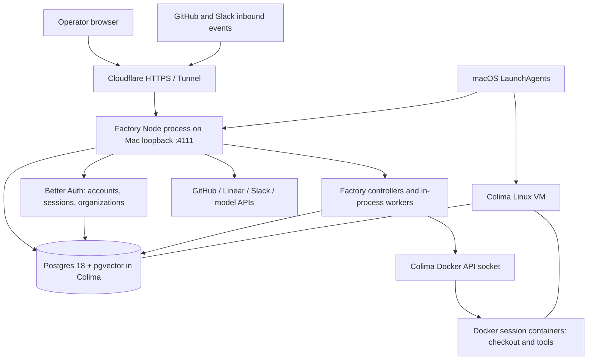

# Project overview and implementation review

Reviewed 2026-09-26 against repository revision `d4f98aa`.

This repository configures and operates a self-hosted Mastra Factory on one Mac. Factory connects software repositories and issue sources to coding agents, runs their work in session containers, and supports delivery through pull requests. The deployment owns its identity database, provider applications, execution infrastructure, and persistent state. It still uses external GitHub, Linear, Slack, Cloudflare, and model-provider services; independence from Mastra's hosted platform does not mean offline operation.

The core design in [the self-hosting research](self-hosting-research.md) has been implemented. Most application behavior comes from installed Mastra packages; this repository supplies the configuration, local infrastructure, operational procedures, and checks that make those packages suitable for this deployment.

This is a repository review, not a fresh production health audit. Source files establish implemented behavior; story records and operator-confirmation commits establish recorded completion. No live sign-in, webhook delivery, agent task, restart, or recovery exercise was performed for this review.

## What the repository contains

| Location | Purpose |
|---|---|
| [src/mastra/index.ts](../src/mastra/index.ts) | The deployment entry: prepare Factory, construct the exported Mastra instance, then finalize startup. |
| [src/mastra/config/](../src/mastra/config/README.md) | Application wiring for storage, vectors, events, authentication, credential encryption, integrations, sandbox selection, and dispatch limits. Tests sit beside the code. |
| [docker-compose.yml](../docker-compose.yml) | The single Postgres 18 + pgvector service, persistent volume, loopback port, restart policy, and health check. |
| [sandbox/](../sandbox/README.md) | The Dockerfile and operating instructions for agent session containers. |
| [apps/](../apps/) | Operator-owned GitHub, Linear, and Slack app setup; Slack also has a committed app manifest. These directories contain configuration and documentation, not application code. |
| [ops/](../ops/README.md) | Mac infrastructure and ingress procedures, LaunchAgent definitions, startup/install scripts, and log-rotation configuration. |
| [.env.schema](../.env.schema), [.env.example](../.env.example) | The authoritative environment-key schema and a configuration starting point. Secret values belong in the ignored `.env`, not in this repository. |
| [README.md](../README.md) | First bring-up, account creation, organization checks, credential encryption, and deployment instructions. |
| [docs/](./) | Design research and explanatory guides, including the [container runtime stack](container-runtime-stack.md) and [development-loop guide](bmad-loop.md). |
| [_bmad-output/](../_bmad-output/) | Requirements, architecture decisions, epics, implementation records, and deferred work. The requirements contract is [SPEC.md](../_bmad-output/specs/spec-self-hosted-factory/SPEC.md) and its named companions. |
| [_bmad/](../_bmad/), [.bmad-loop/](../.bmad-loop/) | Tooling used to develop and verify this deployment; distinct from Factory's own runtime agent workflows. |
| [.agents/skills/](../.agents/skills/), [skills-lock.json](../skills-lock.json) | Vendored development skills and their lock record. Local Factory skill overrides belong under `src/mastra/public/factory-skills/`. |

The project is one TypeScript/ES-module npm package, with no workspaces. [package.json](../package.json) declares Node `^22.19.0 || ^24.0.0` and pins npm to `11.17.0`; the production wrapper selects Node `24.19.0`. Key dependencies are Factory `0.15.0`, Core `1.67.0`, Docker `0.8.0`, Better Auth adapter `1.1.5`, and Postgres adapter `1.25.0`.

## How it works

The diagram describes the intended configured deployment. Linear uses direct OAuth and polling; it is not an inbound webhook or mention source at this package version.

### Startup and configuration

[factory.ts](../src/mastra/config/factory.ts) assembles the configured services into `MastraFactory`. The entry calls `prepare()` to obtain the server/controller configuration, exports a literal `new Mastra(...)`, and calls `finalize()` to initialize the controller and workers. Keeping that constructor in the entry is required by the deployer's source inspection.

Configuration concerns live in separate modules, with each environment key read at one first-party site. Shared database and public-origin values are resolved once and passed to their consumers. `.env.schema` owns key declarations and validation; the README for each subject explains how to obtain and use its values.

The development command runs `mastra factory dev`. Production runs the built artifact through `varlock run -- mastra start`, which validates configuration. Development does not apply the schema, so success in development alone does not establish production readiness.

### Identity and persistence

With the self-hosted configuration selected, Better Auth supplies email/password sign-in and organization support using the same Postgres database as Factory. Auth tables are initialized lazily on an auth request, and a personal organization is bootstrapped on an authenticated request. Registration is closed by the committed `signUpEnabled: false` literal; initial account creation is a temporary, loopback-only procedure documented in the root README.

Postgres stores application records, work items, sessions, agent state, authentication data, and integration credentials. Pgvector provides recall-vector storage in that database. Credentials are encrypted when a valid credential-encryption key is configured. Missing encryption configuration still warns and permits plaintext storage, so configuration remains part of the security boundary.

Compose exposes the database only on `127.0.0.1:54329`, fixes the project name so a checkout rename does not select a different volume, and uses a TCP health check. The deployment uses in-process pubsub without Redis. LibSQL, Redis, platform, and E2B fallback code remains available in the inherited configuration, but those are not the selected self-hosted architecture.

### From issue to agent work

1. The operator connects the owned GitHub App and a repository under their organization. Linear supplies another issue-intake path, and Slack supplies conversation and account-linking surfaces.
2. The upstream Factory package handles intake, work-item state, agent controllers, and dispatch. This repository configures those services rather than implementing a separate workflow engine.
3. A session requests a sandbox. The Docker provider branch takes precedence over cloud providers, allocates by session ID, and refuses a new session when the current process reaches its configured admission limit.
4. The repository checkout and commands run inside the session container. The generic image includes Node, Git, GitHub CLI, Python, build tools, and common utilities; it contains no target repository.
5. Agent results and conversation state persist through Factory storage, while GitHub carries the resulting code changes and pull-request lifecycle. External model APIs provide inference.

Default container ceilings are 10 GiB RAM, four CPU cores, 4,096 processes, and a 15-minute command timeout. Swap is disabled for the container and an init process is explicitly enabled. The default admission limit is three sessions. The dispatcher has a separate concurrency setting; it is not the container limit. See [sandbox/README.md](../sandbox/README.md) for lifecycle and sizing details.

### Host operation

Colima provides a Linux VM using Apple's virtualization backend and exposes the Docker API expected by the sandbox package and Compose. Its committed LaunchAgent requests 12 CPUs, 32 GiB RAM, and a 200 GiB disk.

Cloudflare Tunnel forwards the public HTTPS origin to the loopback HTTP server. LaunchAgents supervise Colima and Factory within the logged-in user's session. The Factory wrapper waits for both a socket and a responsive Docker engine, bounds individual probes, then starts production. The installer places links to the plists and installs log-rotation configuration; it is separate from starting the jobs.

Logout ends the user-session services. FileVault means an unplanned reboot requires physical authentication before recovery. There are no database backups: the Postgres volume is the only persistent copy. These are accepted constraints of the original design, not missing high-availability features promised by the implementation.

## Initial plan versus implementation

The [research document](self-hosting-research.md) is a living document: it retains the September 22 plan and also contains later corrections and links to extracted artifacts. The comparison below uses its original proposals and explicitly identifies corrections already recorded there. Current code and subject READMEs are the better reference when an older research paragraph disagrees.

| Initial plan / research section | What was implemented | Why it stayed or changed |
|---|---|---|
| One Mac, one Node process, Postgres + pgvector, no Redis (§0–1) | Same architecture; Redis was removed from Compose, while optional Redis support remains in code. | One process can use in-memory events; a separate broker is unnecessary for the selected deployment. |
| Docker through Colima rather than Apple Containers (§0, §2) | Docker provider, custom image, Colima `vz` LaunchAgent, explicit socket configuration. | The installed provider requires the Docker API and process-management support; the researched Apple provider did not meet that contract. |
| A small Docker branch with a dated default image (§2.2) | Docker remains first, but an image must be explicitly configured; options also pin init, disable swap, parse integers strictly, and bound individual resource settings. | A guessed image may not exist or may lack Git/`gh`; implicit package defaults and permissive numeric parsing would weaken the intended resource limits. |
| `MASTRACODE_MAX_SANDBOXES=3` caps sessions (§2.3) | A first-party lifecycle-aware registry enforces admission, defaulting to three, without falling through to cloud execution on refusal. | Inspection found that the installed packages did not enforce this cap. The added registry is per process, not a Docker-wide inventory across restarts. |
| Better Auth with organizations; close registration before publishing (§3, §8) | Deferred Better Auth initialization, shared database, literal closed registration, and tests for provider precedence and signup closure. | Organizations are required by the integrations. A source-level signup switch prevents an environment override from reopening registration. |
| Encrypt credentials from the first write (§3, §9) | Encryption and previous-key support, with stricter key-shape and malformed-JSON validation added after initial implementation. | Failures should identify the bad configuration before credentials become unreadable. Absence of the primary key still does not fail closed. |
| Own GitHub App, ten subscribed events, five-minute reconciliation (§5) | Direct integration and setup guide; the installed package allows six events, `push` drives no rule, and reconciliation defaults to hourly. Several subscribed events are acknowledged but ignored. | Package inspection contradicted the original assumptions. Checks/status permissions are documented as headroom rather than evidence of implemented CI handling. See [GitHub](../apps/github/README.md). |
| Linear's five hosted scopes, including app mentions (§6) | Direct OAuth requests `read,comments:create`; issue intake uses polling. No Linear webhook route or app-mention handler is implemented at this version. | Hosted consent behavior was incorrectly attributed to the self-hosted integration. More console permissions cannot add missing package behavior. See [Linear](../apps/linear/README.md). |
| Partial Linear credentials always fail; absent state signer merely changes across restarts (§5–6, §11) | Partial credentials behave asymmetrically under production validation; a complete GitHub/Linear integration requires a stable signer. The signer retains `WORKOS_COOKIE_PASSWORD` as a fallback. | Actual schema/package behavior differs from the initial shorthand. This WorkOS-named secret signs state without selecting hosted WorkOS identity, so the blanket `WORKOS_*` prohibition was too broad. |
| Own Slack app (§6) | Direct Slack integration, committed manifest, event/interactivity setup, and OIDC account-linking instructions. | Preserves the plan and makes app configuration reviewable. A signing secret enables the integration; reply and linking capabilities need their additional credentials. See [Slack](../apps/slack/README.md). |
| Tunnel and LaunchAgents, with a Docker wait wrapper (§4, §7) | Real plists, wrapper, installer, rotation file, and recovery procedures. Docker probes have individual timeouts in addition to the overall wait. | launchd does not order dependencies, and a hung probe would otherwise defeat the overall deadline. Artifact files now own settings previously embedded in research prose. |
| Changes concentrated in a generated entry (§2–3, §10) | A minimal entry and configuration modules, with recorded template provenance and a reconciliation procedure. | Later [architecture decisions AD-4–AD-8](../_bmad-output/planning-artifacts/architecture/architecture-mastra-factory-2026-09-22/ARCHITECTURE-SPINE.md) made code ownership, one-read configuration, and upstream maintenance explicit. |
| Sequential manual checkpoints and type checking (§8) | Tests, a build check, and an expanded repository verify policy accompany the manual checkpoints and operator confirmations. | Type checking cannot prove provider precedence, resource limits, entry compatibility, or operational artifact consistency. The exact gate remains [policy.toml](../.bmad-loop/policy.toml), not a copied command list here. |
| No backups; FileVault recovery requires a person (§7.5, §9) | Unchanged; recovery limitations are documented explicitly. | These were accepted operating tradeoffs. The implementation does not remove the single-machine failure boundary. |

## Completion evidence and remaining gaps

The [sprint record](../_bmad-output/implementation-artifacts/sprint-status.yaml) marks all 24 stories done, although its five epic labels still say `backlog`. Git history includes operator confirmations for account/sandbox setup, public ingress, all three integrations, supervision, and recovery; for example, `0b24334` confirms GitHub, `69973b3` confirms Linear, and `a9c1a0e` confirms recovery. Those records show completion was acknowledged, but do not establish today's service health or prove unsupported features such as Linear mentions.

The [deferred-work ledger](../_bmad-output/implementation-artifacts/deferred-work.md) records both resolved hardening work and open issues. The most consequential review findings are:

- **Production UI packaging needs verification.** DW-117 records that moving `MastraFactory` construction out of the entry prevents the CLI's Factory-project detection and UI-copy step. A build can succeed without producing that UI directory. This checkout contains ignored UI assets dated September 23, which the review build copied into its output; their presence does not prove a fresh checkout regenerates them. Whether the served deployment needs that asset path is still unresolved; build success alone is insufficient proof of a working production UI.
- **Container limits are not a whole-host guarantee.** The registry does not count surviving containers from earlier server processes. Individual CPU/RAM bounds also do not validate resource size multiplied by the configured concurrency (DW-124). Operators still need lifecycle cleanup and coordinated sizing.
- **Recovery evidence is incomplete in the runbook.** Despite the recovery confirmation commit, the log-rotation and planned-restart outcome fields in [ops/README.md](../ops/README.md#recovery-limits) remain placeholders. The held-log-descriptor concern remains recorded in DW-53; the exact observed outcomes should not be inferred from story status.
- **Configuration can still select unintended behavior.** Missing Better Auth configuration can select platform identity; missing encryption configuration permits plaintext credentials. Several whitespace/rotation edge cases remain in the ledger. The documented self-hosted configuration is necessary, not merely an optimization.
- **Planning prose is partly stale.** Research still includes obsolete shorthand about Linear, signer fallback, and environment declarations, while architecture/spec snapshots retain some pre-installation statements. Follow the current source, schema, and subject README when assessing implemented behavior.

The next useful validation is a clean production build followed by actual UI/sign-in and session smoke checks, then recording the missing recovery outcomes. Those operational checks are separate from the source and documentation review delivered here.

## Validation performed for this review

`npm run check` passed, all 141 tests across eight files passed, and `npm run build` completed successfully. The first test attempt was blocked by sandbox access to local Postgres; it passed when rerun with that access. The build also required network access for output dependencies. All relative document links resolve. The full isolated-worktree verify policy was not rerun, and the build used this existing checkout, including its ignored public assets.
